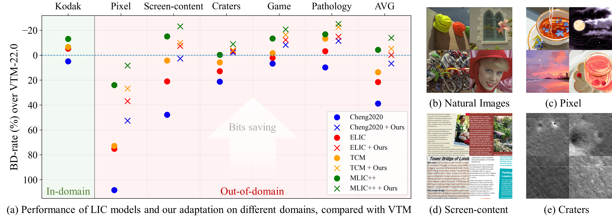
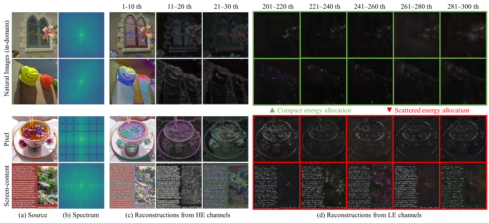
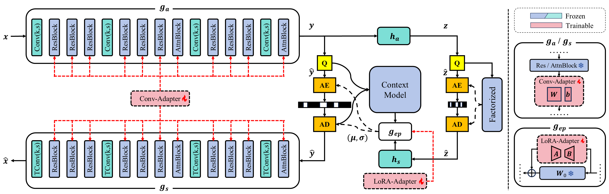

<div align="center">

# Few-Shot Domain Adaptation for Learned Image Compression

Tianyu Zhang, Haotian Zhang, Yuqi Li, Li Li, Dong Liu

<p align="center">
<a href="https://arxiv.org/abs/2409.11111" target="_blank">arXiv</a>  ｜ <a href="https://ojs.aaai.org/index.php/AAAI/article/view/33100" target="_blank">Paper</a> 

</div>

## Abstract
Learned image compression (LIC) has achieved state-of-the-art rate-distortion performance, deemed promising for next generation image compression techniques. However, pretrained LIC models usually suffer from significant performance degradation when applied to out-of-domain images. To tackle this problem, we develop a few-shot domain adaptation method for LIC by integrating plug-and-play adapters into pretrained models. 

<p align="center">
    
    <br>
    <span><b>Figure 1. BD-rate (↓) of four advanced LIC models with or without our method on different domains.</b></span>
</p>

## Motivation
We examine domain gaps in LIC and observe that out-of-domain images disrupt pre-trained channel-wise decomposition. For in-domain images, the energy allocation on channels is more compact, with little information of the source images found in low-energy (LE) channels. However, for out-of-domain images, more contours of source images can be observed.

<p align="center">
     <br>
    <span><b>Figure 2. Channel-wise decomposition of pretrained LIC models on in-domain and out-of-domain images.</b></span>
</p>


## Method
To refine the channel-wise decomposition in the transform, we insert Conv-Adapters after non-linear blocks. For entropy estimation, LoRA-Adapters are applied to the entropy parameters network. Only adapters are trainable.

<p align="center">
     <br>
    <span><b>Figure 3. Deployment of our method on <a href="https://arxiv.org/abs/2203.10886" target="_blank">ELIC</a>.</b></span>
</p>


## Requirements

```
pip install -r requirements.txt
```

## Dataset and Pretrained Weights

Our datasets, pretrained LIC models ([Cheng2020](https://arxiv.org/abs/2001.01568), [ELIC](https://arxiv.org/abs/2203.10886), [MLIC++](https://arxiv.org/abs/2307.15421)) and adapters (using 20 training samples) are available at [google drive](https://drive.google.com/drive/folders/1mzXCj0MZjP1o3W6TK9tYU3kw0ome36YH?usp=sharing).

## Inference
To perform a quick glance at the adaptation performance, please modify `inference.sh`:
```
python3 -W ignore inference.py \
    --test_dataset <YOUR PATH>/datasets/Pixel/test/ \
    --lmbda 0.0018 \
    --model_name ELIC \
    --pretrained_weight <YOUR PATH>/ELIC/pretrained/ELIC_00018.pth \
    --adapters_weight <YOUR PATH>/ELIC/adapters/ELIC_00018_Pixel.pth
```
To conduct practical entropy coding with bitstreams, please modify `compress.sh`. Note that Cheng2020 can be very slow due to its spatial autoregression:
```
python3 -W ignore compress.py \
    --test_dataset <YOUR PATH>/datasets/Pixel/test/ \
    --lmbda 0.0018 \
    --model_name ELIC \
    --pretrained_weight <YOUR PATH>/ELIC/pretrained/ELIC_00018.pth \
    --adapters_weight <YOUR PATH>/ELIC/adapters/ELIC_00018_Pixel.pth \
    --save_dir <YOUR PATH>
```

## Training
Try `adapt.sh` and train your own adapters on more domains!
```
python3 -W ignore adapt.py \
    --train_dataset <YOUR PATH>/datasets/Pixel/train/ \
    --test_dataset <YOUR PATH>/datasets/Pixel/test/ \
    --lmbda 0.0018 \
    --model_name ELIC \
    --pretrained_weight <YOUR PATH>/ELIC/pretrained/ELIC_00018.pth \
    --save_dir <YOUR PATH>
```

## Acknowledgement
This repository is based on [CompressAI](https://github.com/InterDigitalInc/CompressAI), [ELIC-Unofficial](https://github.com/JiangWeibeta/ELIC), [MLIC](https://github.com/JiangWeibeta/MLIC) and [DUIC](https://github.com/llvy21/DUIC/tree/main).

## Citation

If you find this project useful for your research, please kindly cite our paper:

```
@article{zhang2024few,
  title={Few-Shot Domain Adaptation for Learned Image Compression},
  author={Zhang, Tianyu and Zhang, Haotian and Li, Yuqi and Li, Li and Liu, Dong},
  journal={arXiv preprint arXiv:2409.11111},
  year={2024}
}
```


